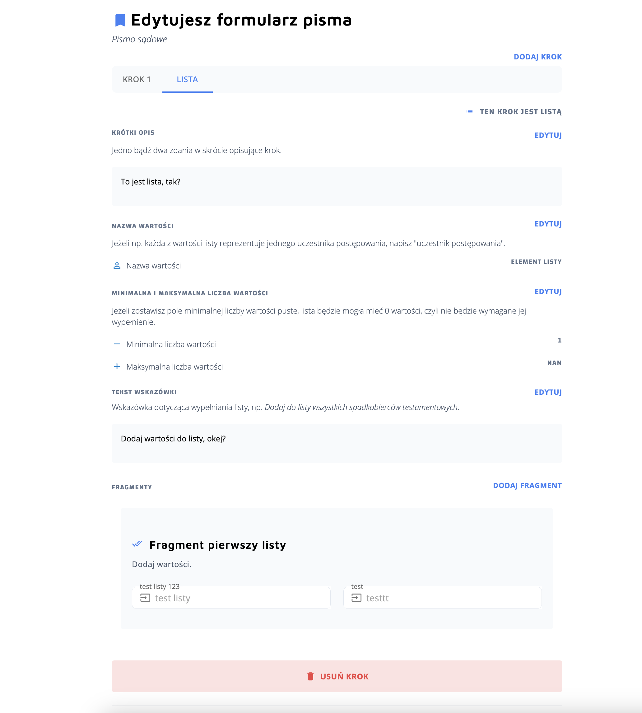
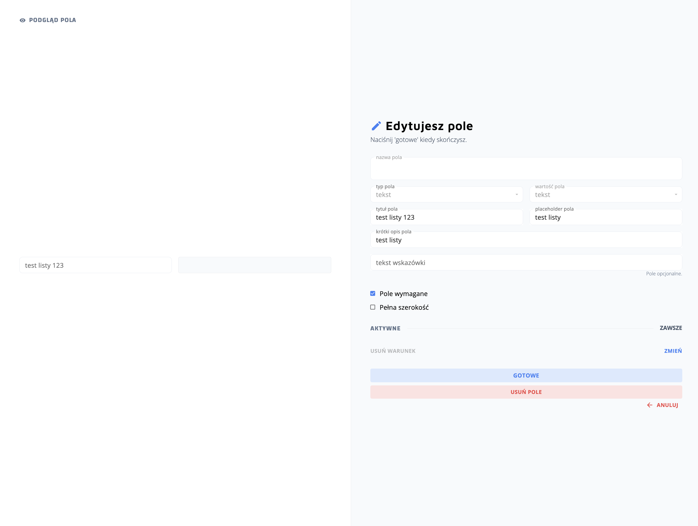
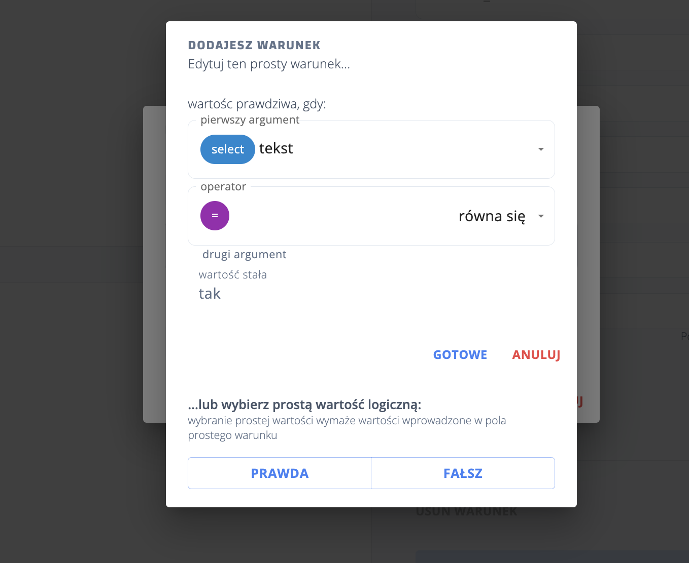
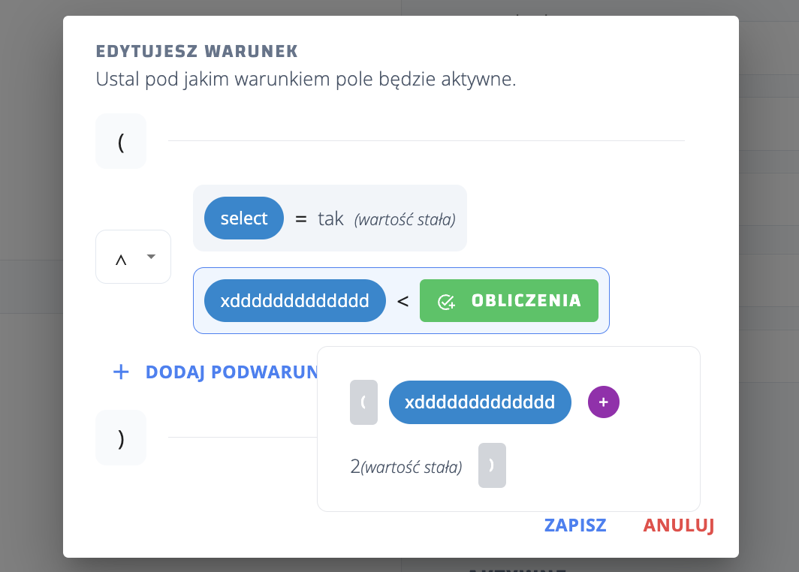
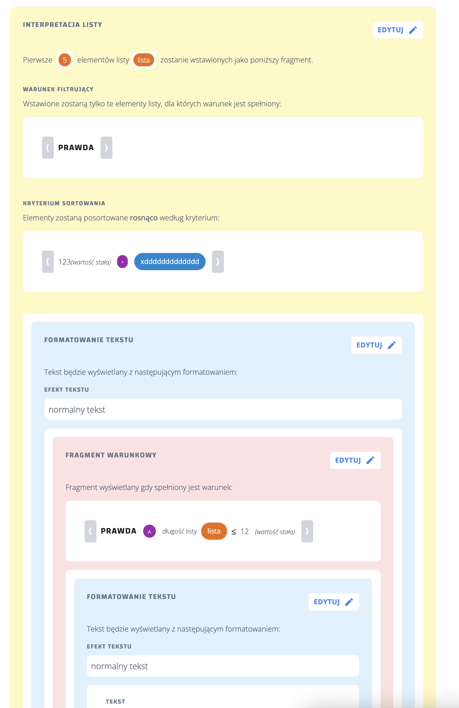
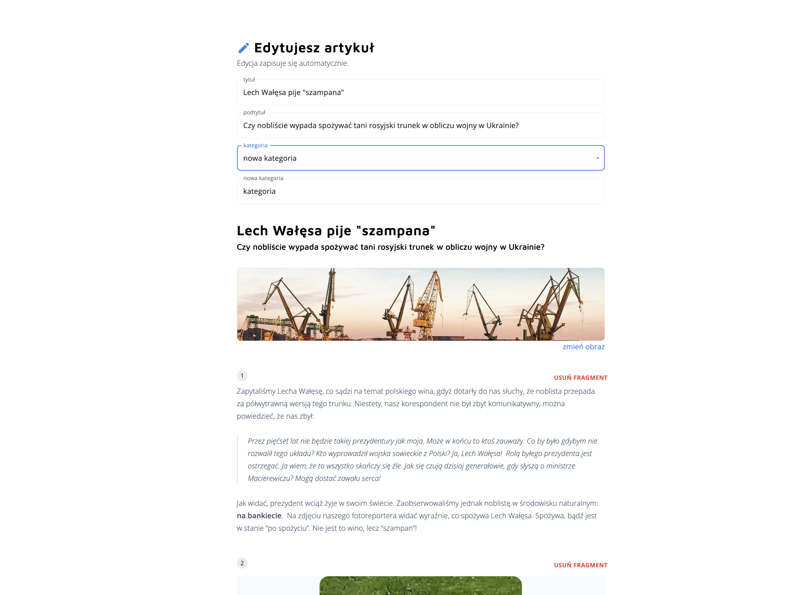
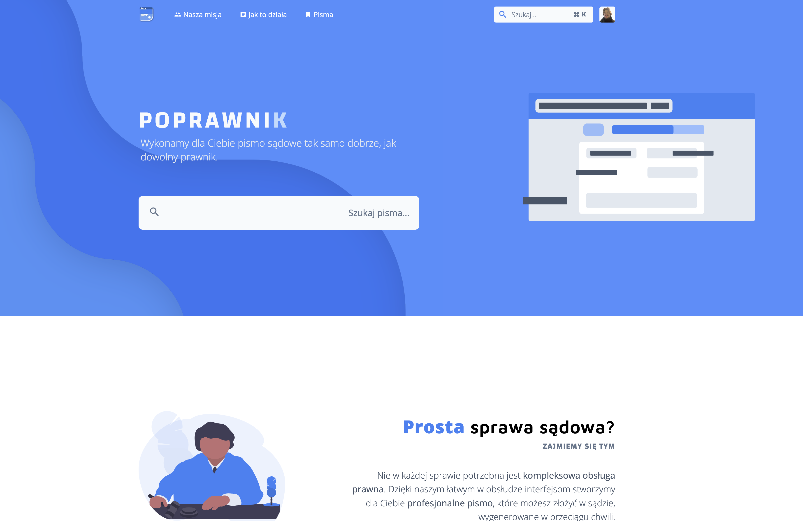

# Poprawnik

This is a later remake of **[Trustree](https://github.com/mtcsla/trustree)**, a legal document store, built in **Next.js** with SSR & SSG and **Firebase** backend services, hosted on **Vercel**.  

Explore here: **[https://poprawnik.vercel.app](https://poprawnik.vercel.app/)**

## Features

- **SSR & SSG**: Server-side rendering and static site generation.

- **Authentication**: Firebase authentication.
    
- **Account system**: User accounts with roles.

- **Form creation UI**: tools for lawyers to create complicated forms (with lists, conditional fields etc).
 
    - Form step editor:
    
    - Form field editor:
    
    - Condition editor:
    
    - Composite condition/calculations editor:
    

 

- **Document template creation UI**: tools for lawyers to create document templates to be filled out by data from forms.
 
    - Template editor:
    

 

- **Generation of legal documents to pdf**

- **Blog**: Blog display and editing.
 
    
 

- **Beautiful UI and landing page**
 
    

